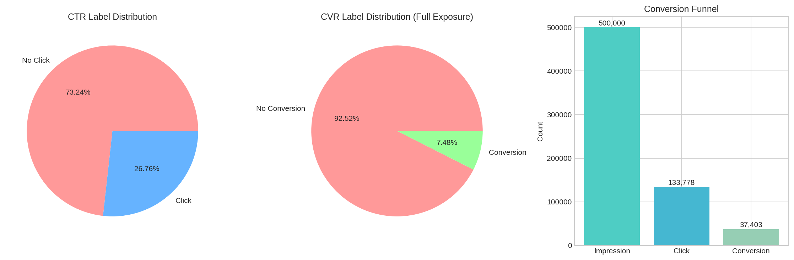
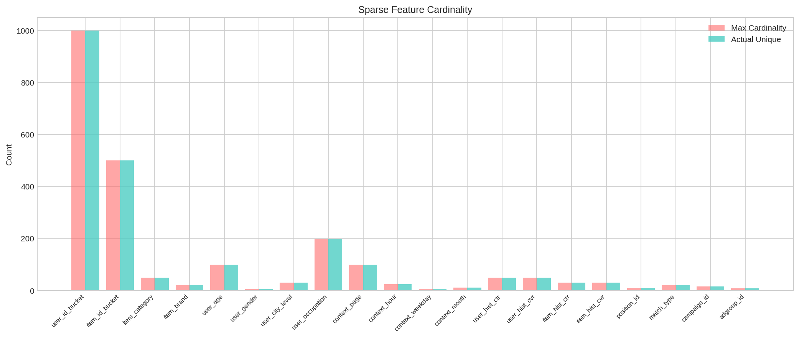
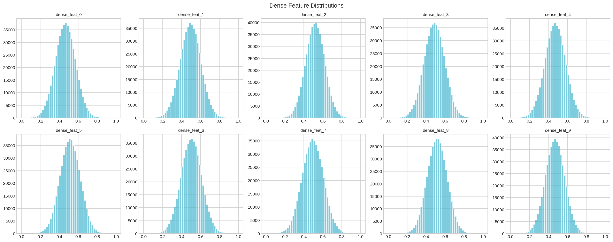
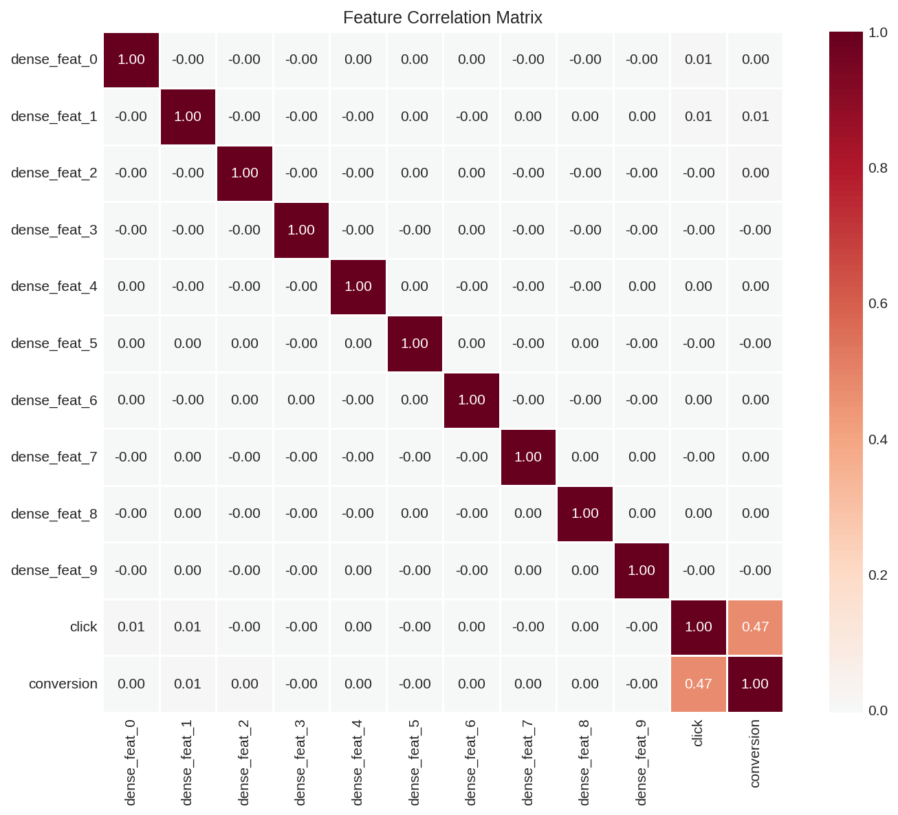
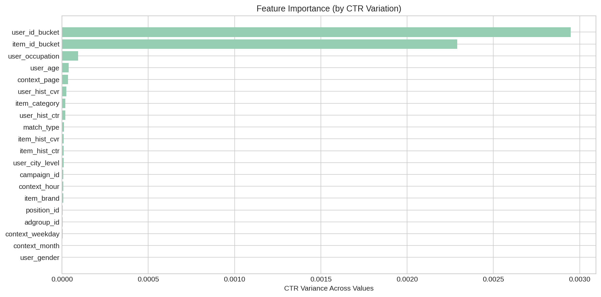

# Multi-Task Learning Dataset Analysis Report

Generated: 2026-03-04 22:57:46

## 1. Basic Statistics

- **total_samples**: 500000
- **num_sparse_features**: 20
- **num_dense_features**: 10
- **click_rate (CTR)**: 0.2676 (26.76%)
- **conversion_rate (CVR)**: 0.0748 (7.48%)
- **cvr_given_click**: 0.2796 (27.96%)
- **click_count**: 133778
- **conversion_count**: 37403
- **non_click_count**: 366222

## 2. Label Distribution

## 3. Sparse Feature Cardinality

| Feature | Cardinality | Max | Coverage |
|---------|-------------|-----|----------|
| user_id_bucket | 1000 | 1000 | 100.0% |
| item_id_bucket | 500 | 500 | 100.0% |
| item_category | 50 | 50 | 100.0% |
| item_brand | 20 | 20 | 100.0% |
| user_age | 100 | 100 | 100.0% |
| user_gender | 5 | 5 | 100.0% |
| user_city_level | 30 | 30 | 100.0% |
| user_occupation | 200 | 200 | 100.0% |
| context_page | 100 | 100 | 100.0% |
| context_hour | 24 | 24 | 100.0% |
| context_weekday | 7 | 7 | 100.0% |
| context_month | 12 | 12 | 100.0% |
| user_hist_ctr | 50 | 50 | 100.0% |
| user_hist_cvr | 50 | 50 | 100.0% |
| item_hist_ctr | 30 | 30 | 100.0% |
| item_hist_cvr | 30 | 30 | 100.0% |
| position_id | 10 | 10 | 100.0% |
| match_type | 20 | 20 | 100.0% |
| campaign_id | 15 | 15 | 100.0% |
| adgroup_id | 8 | 8 | 100.0% |

## 4. Dense Feature Distributions

## 5. Feature Correlation

## 6. ESMM Analysis

- **P(click)**: 0.267556
- **P(conversion)**: 0.074806
- **P(conversion|click)**: 0.279590
- **P(conversion|no_click)**: 0.000000
- **CTCVR = P(click) * P(conv|click)**: 0.074806
- **click_conversion_correlation**: 0.470470

## 7. Feature Importance

## 8. Class Imbalance

- **click_positive_ratio**: 26.76%
- **click_imbalance_ratio**: 1:3
- **conversion_positive_ratio**: 7.48%
- **conversion_imbalance_ratio**: 1:13
- **conversion_given_click_ratio**: 27.96%